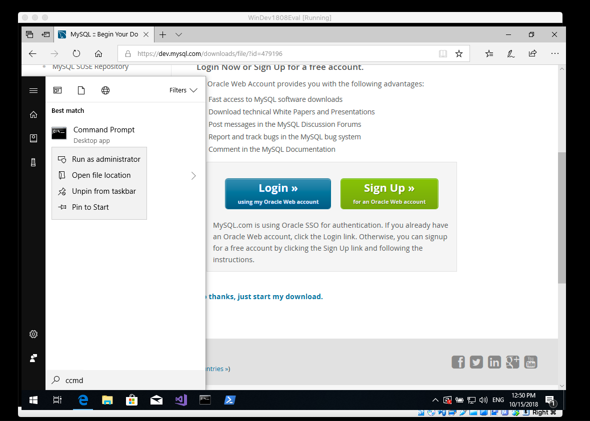
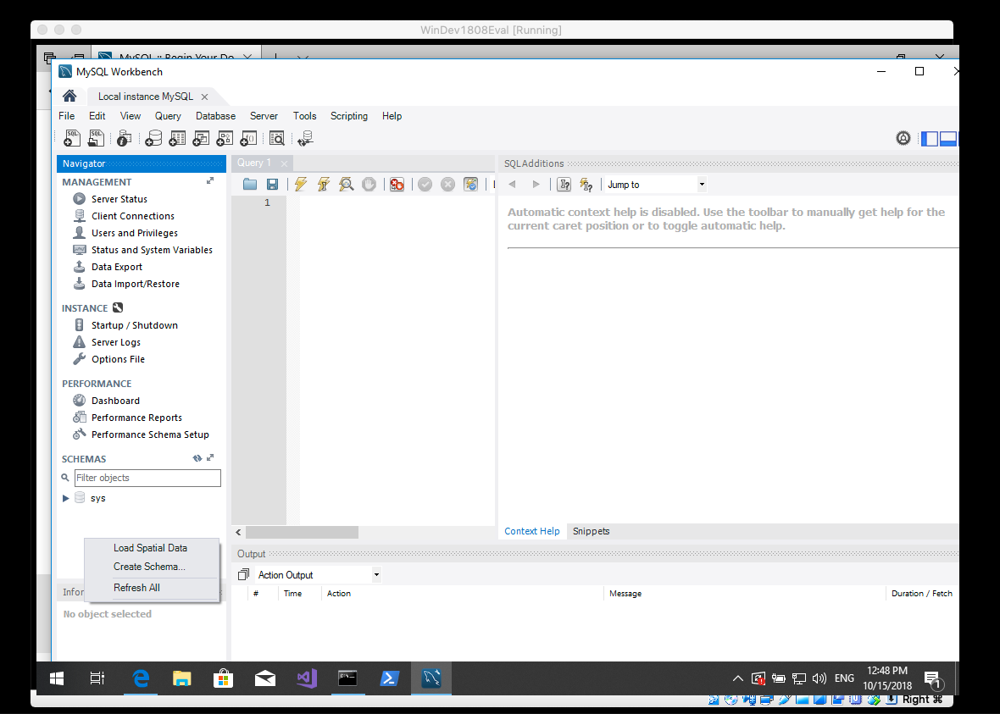
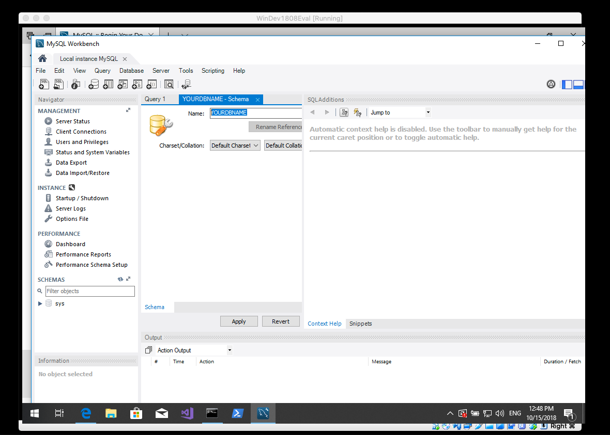
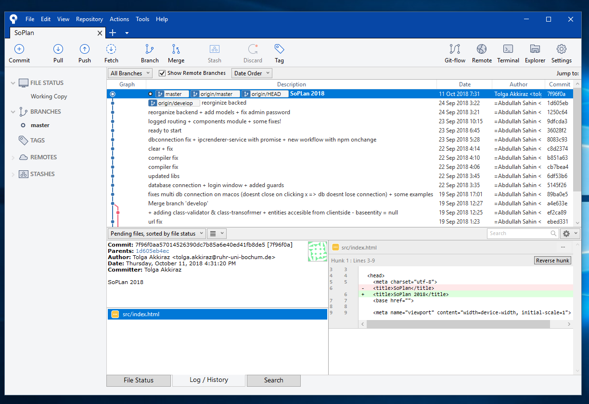
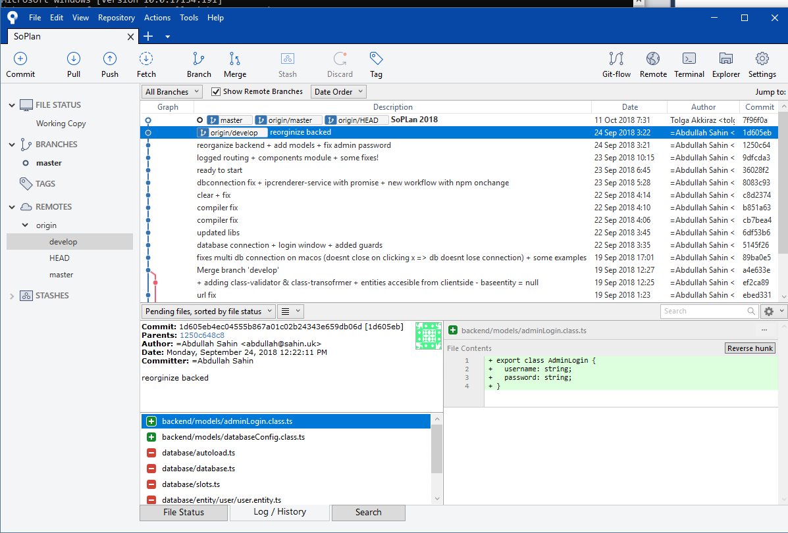

* Windows tool dependencies installation

firstly run **one** of this code lines on depending command prompt -- always as admin

cmd.exe
```
@"%SystemRoot%\System32\WindowsPowerShell\v1.0\powershell.exe" -NoProfile -InputFormat None -ExecutionPolicy Bypass -Command "iex ((New-Object System.Net.WebClient).DownloadString('https://chocolatey.org/install.ps1'))" && SET "PATH=%PATH%;%ALLUSERSPROFILE%\chocolatey\bin"
```
PowerShell.exe
```
Set-ExecutionPolicy Bypass -Scope Process -Force; iex ((New-Object System.Net.WebClient).DownloadString('https://chocolatey.org/install.ps1'))
```

after doing that you'll be able to run this commands - run one by one
```
choco install vscode
choco install git
choco install nodejs
choco install mysql
choco install sourcetree
```
if choco ask you something just enter `Y`

now close your cmd promp and open it again. 
you should be able to use command line tools like `code`, `mysql`, `node` and maybe the most important `npm`.

visit `https://dev.mysql.com/downloads/workbench/`. scroll down to download. you will redirect to a page where you think you ve to sign up, but scroll down and click to `No thanks..``
open mysqlworkbench and create a new `schema`. follow the images:





put your `dragon t-shirt 🐉` on.


open sourcetree, its under `C:\Program Files (x86)\Atlassian\Sourcetree`
◊
login, add youre github account - i preffer to use a ssh key - but you can chance auth to basic and sign in with ur usual github logins.
not you can clone `SoPlan`.
you will see something like this



see the remote branches here:




now open a cmd promp and change dir to your `local soplan repo`. you will see something like e.g. `C:\Users\User\Documents\SoPlan>`

run step by step following commads
```
npm i -g @angular/cli
npm i --save
npm start
```
** keep calm, first time node is accessing it will ask for premission, maybe it can interupt `npm start` so kill it by force via `ctrl + c` and run `npm start` agai

